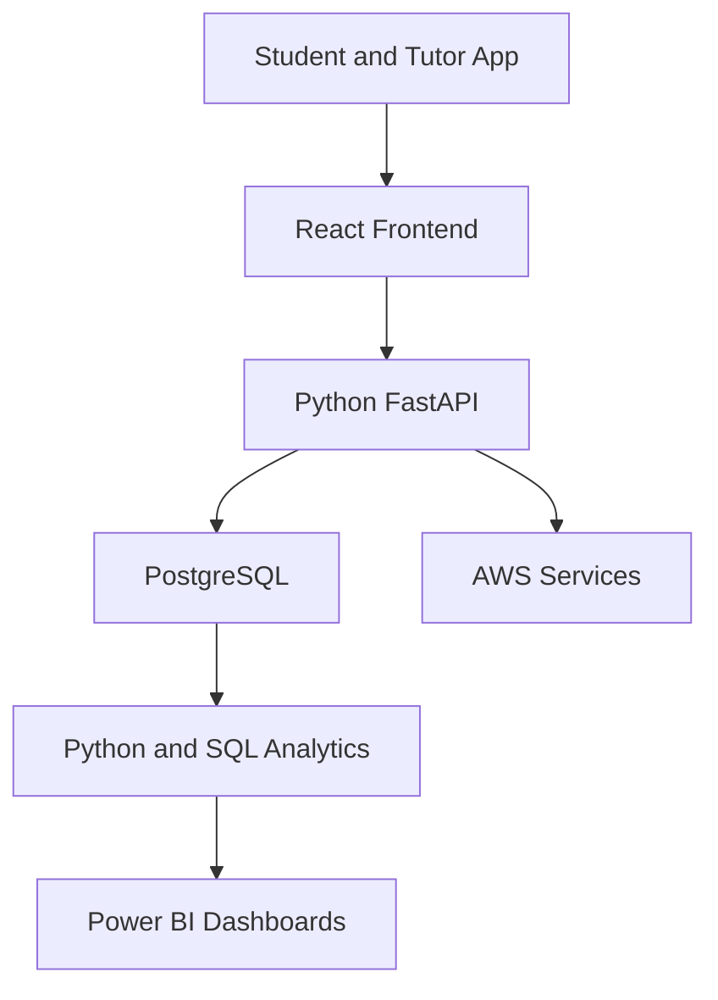

# SkillPulse Learner Success OS

[](https://github.com/janvipatel1910/learner-success-platform/actions/workflows/schema-validation.yml)

A data-driven learner-success platform for AWS and DevOps training cohorts.

> **Current status:** SC-002 — validated PostgreSQL data model and automated schema CI

> **Project owner and lead developer:** Janvi Patel

> **Potential pilot organisation:** UpSkills, subject to written approval

## About the Project

SkillPulse is not a generic course-uploading LMS. It is designed to identify where learners are struggling, help tutors resolve blockers and measure whether support improves learner outcomes.

The platform will combine:

- Full-stack product development
- Data analysis and business intelligence
- AWS cloud architecture
- DevOps automation
- Verified-source AI assistance

## Problem Being Solved

Traditional learning platforms normally track content completion and quiz scores. They do not clearly explain:

- Which learners did not understand a class
- Why a learner is falling behind
- Which topics are weak across a cohort
- Which support requests remain unresolved
- Whether tutor intervention improved performance
- Whether a learner is genuinely exam-ready

SkillPulse will turn learner activity into explainable support actions.

## Unique Learner-Intervention Loop

1. Student attends a class
2. Student submits a Green, Yellow or Red understanding check
3. Quiz, lab and attendance evidence is collected
4. The system detects confidence-versus-competence gaps
5. A blocker or tutor intervention is created
6. The tutor responds and records the resolution
7. The learner repeats the relevant activity
8. The platform measures improvement and updates readiness

## Primary Users

### Students

Access learning materials, complete quizzes, submit AWS labs, report blockers and receive an evidence-based revision plan.

### Tutors

Identify learners needing support, respond to blockers, review weak topics and verify whether interventions worked.

### Administrators

Monitor cohort engagement, attendance, readiness, unresolved blockers, certificate eligibility and course outcomes.

## Planned MVP Features

- Student, tutor and administrator authentication
- Cohort and course management
- Recordings, PDFs, notes and assignments
- Hands-on AWS lab submissions
- Topic-based quizzes
- Original 65-question timed mock exams
- Green, Yellow and Red class-understanding checks
- Blocker and tutor-resolution workflow
- Explainable exam-readiness score
- Confidence-versus-competence analysis
- Certificate eligibility tracker
- Admin analytics
- Excel import and export
- Power BI dashboards
- Verified-source AI tutor with citations

## Technology Stack

| Area | Technologies |
|---|---|
| Frontend | React |
| Backend | Python, FastAPI |
| Database | PostgreSQL |
| Data Analysis | Python, Pandas, SQL |
| Business Intelligence | Power BI, Excel |
| Cloud | AWS |
| DevOps | Git, GitHub Actions, Docker, Terraform |
| Testing | Pytest and frontend testing |
| AI | Retrieval from approved course sources with citations |

## Planned Data Flow



## Current Implementation

| Feature | Status |
|---|---|
| SC-001 PostgreSQL product data model | Complete |
| PostgreSQL 16 execution validation | Complete |
| 29 relational tables | Complete |
| 7 analytics views | Complete |
| SC-002 reusable validation script | Implemented |
| Docker Compose development database | Implemented |
| GitHub Actions schema validation | Implemented |
| FastAPI backend | Planned |
| React learner portal | Planned |
| Python analytics pipeline | Planned |
| Power BI dashboard | Planned |

## Local Development

### Requirements

- Git
- Docker Desktop
- Docker Compose

### Validate the Complete Database Schema

Run:

```bash
./scripts/validate_schema.sh
```

Expected result:

```text
Schema transaction completed successfully.
Validated tables: 29
Validated views: 7
SkillPulse schema validation PASSED.
```

The script creates an isolated PostgreSQL 16 container, validates the complete schema, checks the expected database-object counts and automatically removes the test container.

### Start the Development Database

```bash
docker compose up -d
```

Check database health:

```bash
docker compose ps
```

Stop the development database:

```bash
docker compose down
```

The local PostgreSQL service uses port `55432` by default.

## Repository Structure

```text
learner-success-platform/
├── .github/workflows/       GitHub Actions pipelines
├── analytics/
│   ├── excel/               Excel analysis assets
│   ├── powerbi/             Power BI dashboard assets
│   ├── python/              Python analytics pipelines
│   └── sql/                 Reporting and analysis queries
├── backend/
│   └── database/            PostgreSQL schema
├── data/sample/             Synthetic development data
├── docs/                    Product and validation evidence
├── frontend/                React learner portal
├── infrastructure/
│   └── terraform/           AWS infrastructure as code
├── scripts/                 Development and validation automation
├── tests/                   Automated application tests
├── compose.yaml             Local PostgreSQL service
└── README.md
```

## Database Foundation

The validated PostgreSQL design currently includes:

- Multi-organisation membership
- Student, tutor and administrator roles
- Courses, topics, cohorts and sessions
- Attendance and understanding checks
- Quizzes and 65-question mock exams
- Hands-on lab evidence
- Learner blockers and tutor interventions
- Versioned readiness models
- Explainable readiness snapshots
- Certificate eligibility
- Verified AI sources and citations
- Append-only audit history
- Analytics-ready reporting views

## Documentation

- [Product charter](docs/PRODUCT_CHARTER.md)
- [Product data model](docs/DATA_MODEL.md)
- [SC-001 PostgreSQL validation](docs/SC-001_VALIDATION.md)
- [SC-002 schema CI implementation](docs/SC-002_SCHEMA_CI.md)

## Relationship to Beginner Cloud Journey

The existing `beginner-cloud-journey` repository remains an independent AWS-learning project. SkillPulse may later reuse approved educational concepts or public learning resources, but learner records, application logic and analytics remain inside this separate product repository.

## Responsible Data Principles

- Use synthetic learner data during public development
- Never commit student personal information
- Never store AWS secret keys in lab evidence
- Restrict students to their own records
- Restrict tutors to assigned cohorts
- Keep readiness decisions explainable
- Version all readiness-scoring rules
- Record sensitive administrative actions
- Define retention and deletion procedures before a real pilot
- Obtain written permission before using UpSkills branding or course content

## Project Goal

SkillPulse will demonstrate how full-stack development, data analytics, AWS and DevOps can work together to improve real learner outcomes. Success will be measured through learner progress, blocker resolution, tutor efficiency and explainable exam readiness—not only content completion.
