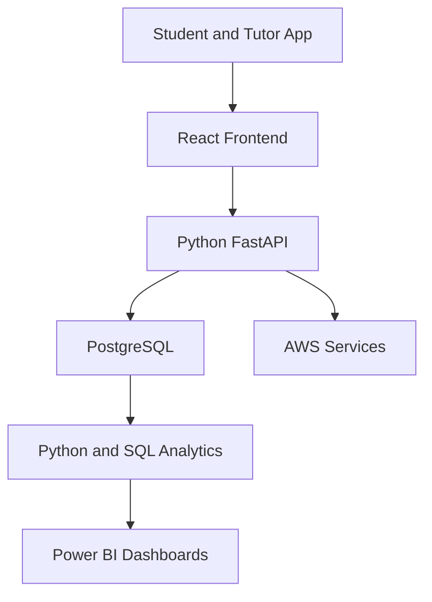

# SkillPulse Learner Success OS

[](https://github.com/janvipatel1910/learner-success-platform/actions/workflows/schema-validation.yml)


[](https://github.com/janvipatel1910/learner-success-platform/actions/workflows/backend-ci.yml)

A data-driven learner-success platform for AWS and DevOps training cohorts.

> **Current status:** SC-008 — organisation-scoped class-session management API
> **Project owner and lead developer:** Janvi Patel

> **Potential pilot organisation:** UpSkills, subject to written approval

## About the Project

SkillPulse is not a generic course-uploading LMS. It is designed to identify where learners are struggling, help tutors resolve blockers and measure whether support improves learner outcomes.

The platform will combine:

- Full-stack product development
- Data analysis and business intelligence
- AWS cloud architecture
- DevOps automation
- Verified-source AI assistance

## Problem Being Solved

Traditional learning platforms normally track content completion and quiz scores. They do not clearly explain:

- Which learners did not understand a class
- Why a learner is falling behind
- Which topics are weak across a cohort
- Which support requests remain unresolved
- Whether tutor intervention improved performance
- Whether a learner is genuinely exam-ready

SkillPulse will turn learner activity into explainable support actions.

## Unique Learner-Intervention Loop

1. Student attends a class
2. Student submits a Green, Yellow or Red understanding check
3. Quiz, lab and attendance evidence is collected
4. The system detects confidence-versus-competence gaps
5. A blocker or tutor intervention is created
6. The tutor responds and records the resolution
7. The learner repeats the relevant activity
8. The platform measures improvement and updates readiness

## Primary Users

### Students

Access learning materials, complete quizzes, submit AWS labs, report blockers and receive an evidence-based revision plan.

### Tutors

Identify learners needing support, respond to blockers, review weak topics and verify whether interventions worked.

### Administrators

Monitor cohort engagement, attendance, readiness, unresolved blockers, certificate eligibility and course outcomes.

## Planned MVP Features

- Student, tutor and administrator authentication
- Cohort and course management
- Recordings, PDFs, notes and assignments
- Hands-on AWS lab submissions
- Topic-based quizzes
- Original 65-question timed mock exams
- Green, Yellow and Red class-understanding checks
- Blocker and tutor-resolution workflow
- Explainable exam-readiness score
- Confidence-versus-competence analysis
- Certificate eligibility tracker
- Admin analytics
- Excel import and export
- Power BI dashboards
- Verified-source AI tutor with citations

## Technology Stack

| Area | Technologies |
|---|---|
| Frontend | React |
| Backend | Python, FastAPI |
| Database | PostgreSQL |
| Data Analysis | Python, Pandas, SQL |
| Business Intelligence | Power BI, Excel |
| Cloud | AWS, Amazon Cognito |
| DevOps | Git, GitHub Actions, Docker, Terraform |
| Testing | Pytest and frontend testing |
| AI | Retrieval from approved course sources with citations |

## Planned Data Flow



## Current Implementation

| Feature | Status |
|---|---|
| SC-001 PostgreSQL product data model | Complete |
| PostgreSQL 16 execution validation | Complete |
| 29 relational tables | Complete |
| 7 analytics views | Complete |
| SC-002 reusable validation script | Implemented |
| Docker Compose development database | Implemented |
| GitHub Actions schema validation | Implemented |
| SC-003 FastAPI backend foundation | Implemented |
| PostgreSQL readiness integration | Implemented |
| Containerized non-root API service | Implemented |
| Backend quality and test CI | Implemented |
| SC-004 Alembic database migrations | Implemented |
| Reversible upgrade and downgrade cycle | Validated |
| Deterministic synthetic learner data | Implemented |
| Synthetic analytics-view coverage | Validated |
| SC-005 Cognito-compatible access-token verification | Implemented |
| Database-backed organisation role authorization | Implemented |
| Protected current-user API endpoint | Implemented |
| Authentication and RBAC security tests | Validated |
| SC-006 organisation-scoped catalog API | Implemented |
| Course, topic and cohort management | Implemented |
| Admin-write and member-read authorization | Validated |
| Catalog API and PostgreSQL integration tests | Validated |
| SC-007 organisation-scoped cohort enrollment API | Implemented |
| Personal cohort membership and roster operations | Implemented |
| Assigned-tutor and administrator authorization | Validated |
| Enrollment API and PostgreSQL integration tests | Validated |
| SC-008 organisation-scoped class-session API | Implemented |
| Cohort session read, create and update operations | Implemented |
| Learner, assigned-tutor and administrator authorization | Validated |
| Class-session API and PostgreSQL integration tests | Validated |
| React learner portal | Planned |
| Python analytics pipeline | Planned |
| Power BI dashboard | Planned |

## Local Development

### Requirements

- Git
- Docker Desktop
- Docker Compose

### Validate the Complete Database Schema

Run:

```bash
./scripts/validate_schema.sh
```

Expected result:

```text
Schema transaction completed successfully.
Validated tables: 29
Validated views: 7
SkillPulse schema validation PASSED.
```

The script creates an isolated PostgreSQL 16 container, validates the complete schema, checks the expected database-object counts and automatically removes the test container.

### Start the Development Database

```bash
docker compose up -d database
docker compose run --rm migration
```

Check database health:

```bash
docker compose ps
```

Stop the development database:

```bash

### Configure Amazon Cognito Authenticationdocker compose down
```

The local PostgreSQL service uses port `55432` by default.
### Start the Complete Application Stack

Build and start PostgreSQL and the FastAPI service:

```bash
docker compose up -d --build
```

Check container health:

```bash
docker compose ps
```

Verify API and database readiness:

```bash
curl -fsS http://127.0.0.1:8000/ready
```

Available local endpoints:

- API information: `http://127.0.0.1:8000/`
- Liveness: `http://127.0.0.1:8000/health`
- Readiness: `http://127.0.0.1:8000/ready`
- OpenAPI documentation: `http://127.0.0.1:8000/docs`

Stop the application stack without deleting the database volume:

```
docker compose down
```


### Configure Amazon Cognito Authentication


SkillPulse validates signed Amazon Cognito access tokens. Configure the trusted user pool in `.env`:
```dotenv
COGNITO_REGION=eu-west-2
COGNITO_USER_POOL_ID=replace_with_user_pool_id
COGNITO_APP_CLIENT_ID=replace_with_app_client_id
JWT_CLOCK_SKEW_SECONDS=30
```

These values identify trusted authentication infrastructure; they are not user credentials or application secrets.

The API verifies:

- RS256 token signatures using the Cognito JSON Web Key Set
- Trusted user-pool issuer
- Access-token `token_use`
- Application `client_id`
- Required subject, issue-time and expiry claims
- Token expiration with controlled clock skew

A verified Cognito `sub` is mapped to `users.auth_subject`. Active organisation memberships in PostgreSQL remain the authorization source for `student`, `tutor` and `admin` roles. Cognito token groups are not trusted as application roles.

Request the authenticated SkillPulse identity:

```bash
export COGNITO_ACCESS_TOKEN="replace_with_access_token"

curl -fsS \
  -H "Authorization: Bearer ${COGNITO_ACCESS_TOKEN}" \
  http://127.0.0.1:8000/api/v1/auth/me
```

Missing or invalid credentials return `401`, authenticated subjects without an active SkillPulse identity return `403`, and unavailable authentication or identity infrastructure returns `503`.

### Use the Course Catalog API

All catalog requests require a verified bearer token and the authorized organisation context in the `X-Organization-ID` header.

| Resource | Endpoint | Supported methods |
|---|---|---|
| Courses | `/api/v1/catalog/courses` | `GET`, `POST` |
| Course | `/api/v1/catalog/courses/{course_id}` | `GET`, `PUT` |
| Topics | `/api/v1/catalog/courses/{course_id}/topics` | `GET`, `POST` |
| Topic | `/api/v1/catalog/courses/{course_id}/topics/{topic_id}` | `GET`, `PUT` |
| Cohorts | `/api/v1/catalog/courses/{course_id}/cohorts` | `GET`, `POST` |
| Cohort | `/api/v1/catalog/courses/{course_id}/cohorts/{cohort_id}` | `GET`, `PUT` |

Active `student`, `tutor` and `admin` organisation members can read catalog records. Only administrators can create or update them. Cross-organisation access is denied, and lifecycle status changes are used instead of destructive delete endpoints.
### Use the Cohort Enrollment API

Enrollment requests require a verified bearer token and the authorised organisation context in the `X-Organization-ID` header.

| Resource | Endpoint | Supported methods |
|---|---|---|
| My memberships | `/api/v1/catalog/my-cohort-memberships` | `GET` |
| Cohort roster | `/api/v1/catalog/courses/{course_id}/cohorts/{cohort_id}/members` | `GET`, `POST` |
| Roster member | `/api/v1/catalog/courses/{course_id}/cohorts/{cohort_id}/members/{membership_id}` | `GET`, `PUT` |

Students, tutors and administrators can list their own memberships. Administrators can read and manage rosters. Tutors can read a roster only when they hold an active tutor assignment in that cohort. Students cannot read rosters, and only administrators can create or update memberships.


### Use the Class Session API

Class-session requests require a verified bearer token and the authorised organisation context in the `X-Organization-ID` header.

| Resource | Endpoint | Supported methods |
|---|---|---|
| Cohort sessions | `/api/v1/catalog/courses/{course_id}/cohorts/{cohort_id}/sessions` | `GET`, `POST` |
| Class session | `/api/v1/catalog/courses/{course_id}/cohorts/{cohort_id}/sessions/{session_id}` | `GET`, `PUT` |

Active learners can read sessions only in cohorts where they hold an active learner membership. Assigned active tutors can read, create and update sessions in their cohorts. Administrators can read and manage sessions across their organisation. Topics must belong to the cohort's course, timestamps must include a timezone, and cancellation uses the `cancelled` lifecycle status instead of deletion.


### Manage Database Migrations

The migration service waits for PostgreSQL to become healthy before applying the latest revision.

Apply all pending migrations:

```bash
docker compose run --rm migration
```

Inspect the current revision:

```bash
docker compose run --rm migration python -m alembic current
```

Downgrade one revision when validating rollback behavior:

```bash
docker compose run --rm migration python -m alembic downgrade -1
```

### Load Synthetic Demonstration Data

After installing the Python project, load the deterministic fictional dataset:

```bash
python scripts/seed_synthetic_data.py
```

The seed is idempotent, uses reserved `.example` email addresses, populates all seven analytics views and is blocked when `ENVIRONMENT=production`.

### Run the FastAPI Source Locally

Create and activate a virtual environment, then install the project:

```bash
python3 -m venv .venv
source .venv/bin/activate
python -m pip install --upgrade pip
python -m pip install ".[dev]"
```

Start the source application:

```bash
PYTHONPATH=backend python -m uvicorn skillpulse.main:app \
  --host 127.0.0.1 \
  --port 8000
```

### Run Backend Validation

```bash
ruff check backend scripts tests
pytest -m "not integration"
RUN_DATABASE_TESTS=true RUN_SEED_TESTS=true pytest -m integration
```

## Repository Structure

```text
learner-success-platform/
|-- .github/
|   `-- workflows/
|       |-- backend-ci.yml
|       `-- schema-validation.yml
|-- analytics/
|   |-- excel/
|   |-- powerbi/
|   |-- python/
|   `-- sql/
|-- backend/
|   |-- database/
|   |   `-- schema.sql
|   |-- migrations/
|   |   |-- sql/
|   |   |-- versions/
|   |   `-- env.py
|   |-- skillpulse/
|   |   |-- api/
|   |   |-- core/
|   |   |-- db/
|   |   |-- schemas/
|   |   `-- main.py
|   `-- Dockerfile
|-- data/
|   `-- sample/
|       `-- skillpulse_seed.sql
|-- docs/
|   |-- PRODUCT_CHARTER.md
|   |-- DATA_MODEL.md
|   |-- SC-001_VALIDATION.md
|   |-- SC-002_SCHEMA_CI.md
|   |-- SC-003_FASTAPI_FOUNDATION.md
|   |-- SC-004_DATABASE_MIGRATIONS_AND_SEED_DATA.md
|   |-- SC-005_AUTHENTICATION_AUTHORIZATION.md
|   |-- SC-006_COURSE_TOPIC_COHORT_API.md
|   |-- SC-007_COHORT_ENROLLMENT_API.md
|   `-- SC-008_CLASS_SESSION_API.md
|-- frontend/
|-- infrastructure/
|   `-- terraform/
|-- scripts/
|   |-- __init__.py
|   |-- seed_synthetic_data.py
|   `-- validate_schema.sh
|-- tests/
|   `-- backend/
|       |-- conftest.py
|       |-- test_auth.py
|       |-- test_authorization.py
|       |-- test_catalog_cohorts.py
|       |-- test_catalog_courses.py
|       |-- test_catalog_database.py
|       |-- test_catalog_schemas.py
|       |-- test_catalog_topics.py
|       |-- test_cohort_enrollment_database.py
|       |-- test_cohort_enrollments.py
|       |-- test_enrollment_schemas.py
|       |-- test_config.py
|       |-- test_database.py
|       |-- test_health.py
|       |-- test_identity.py
|       |-- test_migrations_and_seed.py
|       `-- test_seed_data.py
|-- .dockerignore
|-- .env.example
|-- .gitignore
|-- alembic.ini
|-- compose.yaml
|-- pyproject.toml
`-- README.md
```


## Database Foundation

The validated PostgreSQL design currently includes:

- Multi-organisation membership
- Student, tutor and administrator roles
- Courses, topics, cohorts and sessions
- Attendance and understanding checks
- Quizzes and 65-question mock exams
- Hands-on lab evidence
- Learner blockers and tutor interventions
- Versioned readiness models
- Explainable readiness snapshots
- Certificate eligibility
- Verified AI sources and citations
- Append-only audit history
- Analytics-ready reporting views

## Documentation

- [Product charter](docs/PRODUCT_CHARTER.md)
- [Product data model](docs/DATA_MODEL.md)
- [SC-001 PostgreSQL validation](docs/SC-001_VALIDATION.md)
- [SC-002 schema CI implementation](docs/SC-002_SCHEMA_CI.md)

- [SC-003 FastAPI backend foundation](docs/SC-003_FASTAPI_FOUNDATION.md)

- [SC-004 database migrations and synthetic data](docs/SC-004_DATABASE_MIGRATIONS_AND_SEED_DATA.md)

- [SC-005 authentication and organisation authorization](docs/SC-005_AUTHENTICATION_AUTHORIZATION.md)
- [SC-006 course, topic and cohort management API](docs/SC-006_COURSE_TOPIC_COHORT_API.md)
- [SC-007 cohort enrollment and roster API](docs/SC-007_COHORT_ENROLLMENT_API.md)
- [SC-008 class-session management API](docs/SC-008_CLASS_SESSION_API.md)


## Relationship to Beginner Cloud Journey

The existing `beginner-cloud-journey` repository remains an independent AWS-learning project. SkillPulse may later reuse approved educational concepts or public learning resources, but learner records, application logic and analytics remain inside this separate product repository.

## Responsible Data Principles

- Use synthetic learner data during public development
- Never commit student personal information
- Never store AWS secret keys in lab evidence
- Restrict students to their own records
- Restrict tutors to assigned cohorts
- Keep readiness decisions explainable
- Version all readiness-scoring rules
- Record sensitive administrative actions
- Define retention and deletion procedures before a real pilot
- Obtain written permission before using UpSkills branding or course content

## Project Goal

SkillPulse will demonstrate how full-stack development, data analytics, AWS and DevOps can work together to improve real learner outcomes. Success will be measured through learner progress, blocker resolution, tutor efficiency and explainable exam readiness—not only content completion.
