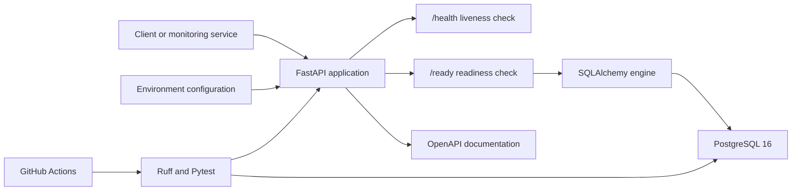

# SC-003 FastAPI Backend Foundation

## Validation Summary

- Project: SkillPulse Learner Success OS
- Feature: SC-003 FastAPI Backend Foundation
- Owner and lead developer: Janvi Patel
- Validation date: 21 August 2026
- Branch: `feature/sc-003-fastapi-foundation`
- Local result: Passed
- GitHub Actions result: Pending first branch execution

SC-003 establishes the first application-service layer for SkillPulse. It connects a typed FastAPI application to PostgreSQL, exposes operational health endpoints, supports environment-based configuration, runs in a non-root Docker container and includes automated unit, integration and code-quality checks.

No real learner, tutor or organisation data was used during development or validation.

## 1. Objective

The objective of SC-003 is to create a reliable backend foundation before implementing authentication or learner-facing product features.

The foundation must:

- Start as a typed FastAPI application
- Load configuration safely from environment variables
- Connect to PostgreSQL
- Distinguish API liveness from database readiness
- Generate OpenAPI documentation automatically
- Run locally and in Docker
- Run without root privileges inside the application container
- Include repeatable unit and database integration tests
- Validate Python 3.13 and Python 3.14 in GitHub Actions
- Avoid committing credentials or generated package metadata

## 2. Implemented Architecture



## 3. Backend Structure

```text
backend/
├── Dockerfile
└── skillpulse/
    ├── __init__.py
    ├── main.py
    ├── api/
    │   └── routes/
    │       └── health.py
    ├── core/
    │   └── config.py
    ├── db/
    │   └── connection.py
    └── schemas/
        └── health.py
```

The application uses an application factory so future tests and deployment environments can create the API with controlled settings.

## 4. API Endpoints

| Method | Endpoint | Purpose | Success response |
|---|---|---|---|
| `GET` | `/` | Service metadata and useful links | `200` |
| `GET` | `/health` | Confirms that the API process is alive | `200` |
| `GET` | `/ready` | Confirms that the API can connect to PostgreSQL | `200` |
| `GET` | `/docs` | Interactive OpenAPI documentation | `200` |
| `GET` | `/openapi.json` | Machine-readable API contract | `200` |

If PostgreSQL is unavailable, `/ready` returns:

- HTTP status `503`
- Status `not_ready`
- Database state `unavailable`

This separation allows load balancers and container platforms to distinguish a running process from an application that is ready to receive database-dependent traffic.

## 5. Configuration

Configuration is implemented using Pydantic Settings.

Supported settings include:

- Application name and version
- Runtime environment
- API prefix
- PostgreSQL database name
- PostgreSQL username
- PostgreSQL password
- PostgreSQL hostname
- PostgreSQL port
- Database connection timeout
- Allowed frontend CORS origins

The PostgreSQL password is represented as a secret value. SQLAlchemy URL construction is typed, and the password is not exposed by the normal URL string representation.

The committed `.env.example` contains development placeholders only. Real credentials remain outside version control.

## 6. Database Connectivity

SQLAlchemy manages the database engine using the Psycopg PostgreSQL driver.

Connection behaviour includes:

- Pre-ping before reusing pooled connections
- Connection recycling
- Bounded connection pool configuration
- Configurable connection timeout
- Safe disposal during FastAPI application shutdown
- A lightweight `SELECT 1` readiness query
- Controlled logging without exposing credentials

## 7. Docker Implementation

The FastAPI service is packaged using `python:3.14-slim`.

Container controls include:

- Application runs as the non-root `skillpulse` user
- Python bytecode generation is disabled
- Python output is unbuffered
- Pip cache is disabled
- Only required application files are copied
- Port `8000` is explicitly exposed
- A container health check calls `/health`
- Docker Compose waits for PostgreSQL to become healthy
- The API connects to PostgreSQL using the internal Compose service name

The `.dockerignore` file excludes:

- Git metadata
- Virtual environments
- Python caches
- Package metadata
- Local environment files
- Tests and development-only directories
- Operating-system metadata

## 8. Automated Testing

### Unit and API tests

The test suite validates:

- Root service metadata
- Health response metadata
- UTC timestamp output
- Successful readiness response
- Failed readiness response with HTTP `503`
- OpenAPI route registration
- Typed database URL generation
- Environment-variable configuration
- Invalid configuration rejection

### PostgreSQL integration test

The integration test performs a real connection to PostgreSQL and validates the readiness query.

It is protected by `RUN_DATABASE_TESTS=true`, preventing accidental database-dependent execution during ordinary unit-test runs.

## 9. Local Validation Results

| Validation | Result |
|---|---|
| Ruff code-quality check | Passed |
| Unit and API tests | 8 passed |
| PostgreSQL integration tests | 1 passed |
| FastAPI import and application creation | Passed |
| Environment template parsing | Passed |
| Docker Compose configuration | Passed |
| FastAPI Docker image build | Passed |
| PostgreSQL container health | Healthy |
| FastAPI container health | Healthy |
| Containerized `/ready` endpoint | Ready and connected |
| Interactive OpenAPI documentation | Available |

### Unit-test command

```bash
pytest -m "not integration"
```

### Integration-test command

```bash
RUN_DATABASE_TESTS=true PYTHONPATH=backend pytest -m integration
```

### Code-quality command

```bash
ruff check backend tests
```

### Docker validation commands

```bash
docker compose config --quiet
docker compose build backend
docker compose up -d backend
docker compose ps
curl -fsS http://127.0.0.1:8000/ready
```

Validated readiness response:

```json
{
  "status": "ready",
  "service": "SkillPulse API",
  "database": "connected"
}
```

## 10. Backend Continuous Integration

The Backend CI workflow contains two independent controls.

### Quality and unit-test matrix

The workflow executes against:

- Python 3.13
- Python 3.14

Each matrix job:

1. Checks out the repository
2. Installs the project and development dependencies
3. Runs Ruff
4. Runs tests that do not require PostgreSQL

### PostgreSQL integration job

The integration job:

1. Starts an isolated PostgreSQL 16 service
2. Waits for PostgreSQL health validation
3. Installs the backend
4. injects test-only database configuration
5. Enables database integration tests
6. Executes the PostgreSQL test marker

The workflow has read-only repository permissions, path filtering, concurrency control and a ten-minute timeout.

## 11. Security and Privacy Decisions

SC-003 introduces the following controls:

- No production credentials are committed
- Passwords use secret-aware configuration types
- Database errors do not expose full connection strings
- Application container runs without root privileges
- CORS origins are environment controlled
- Readiness failure returns a controlled response
- Generated Python metadata is excluded from Git
- No real learner data is included
- CI PostgreSQL credentials are isolated test values
- Docker build context excludes local environment files

Authentication, authorisation and row-level access control are intentionally deferred to later features and must be completed before real learner data is processed.

## 12. Technical Issue Resolved

On the local macOS Python 3.14 environment, editable installation metadata created inside the Documents workspace was treated as hidden by Python site-package processing.

The project was validated using:

- A normal wheel installation for package import
- `PYTHONPATH=backend` for local source execution
- Explicit package discovery in `pyproject.toml`

This preserves reproducible local development without changing global Python security behaviour.

## 13. Acceptance Criteria

SC-003 is locally complete because:

- [x] FastAPI application starts successfully
- [x] PostgreSQL connectivity is implemented
- [x] `/health` returns HTTP `200`
- [x] `/ready` returns HTTP `200` when PostgreSQL is available
- [x] `/ready` returns HTTP `503` when PostgreSQL is unavailable
- [x] OpenAPI documentation is generated
- [x] Configuration is environment based
- [x] Unit tests pass
- [x] Real PostgreSQL integration test passes
- [x] Ruff passes
- [x] Docker image builds successfully
- [x] API and database containers become healthy
- [x] Application container runs as a non-root user
- [x] Backend CI workflow is defined
- [ ] GitHub pull-request checks pass

## 14. Next Steps

The next backend features should add:

1. Database migration tooling
2. User and organisation repositories
3. Authentication and role-based access control
4. Student, tutor and administrator API permissions
5. Synthetic seed data
6. Structured application logging
7. Request correlation identifiers
8. API-level audit events
9. Learner understanding-check endpoints
10. Tutor blocker and intervention endpoints

## Final Result

SC-003 converts SkillPulse from a validated database design into an operational backend service. The application now has a tested API foundation, real PostgreSQL connectivity, Docker packaging, health monitoring and automated CI controls suitable for incremental product development.
