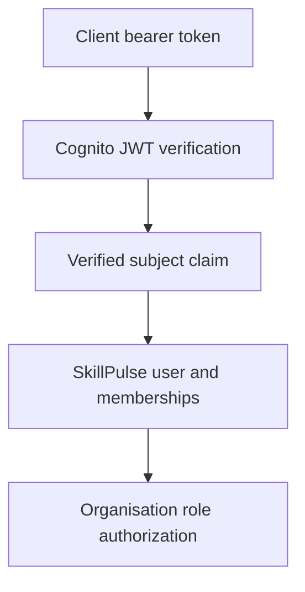

# SC-005: Authentication and Organisation Role Authorization

## Validation Summary

| Control | Result |
|---|---|
| Cognito-compatible RS256 access-token verification | Passed |
| Trusted issuer validation | Passed |
| Cognito application client validation | Passed |
| Access-token `token_use` validation | Passed |
| Token expiry and required-claim validation | Passed |
| Cognito subject to SkillPulse user mapping | Passed |
| Database-backed organisation roles | Passed |
| Student, tutor and admin authorization guard | Passed |
| Generic 401, 403 and 503 responses | Passed |
| OpenAPI bearer-security documentation | Passed |
| Python code-quality validation | Passed |
| Unit, API and security tests | 33 passed |
| PostgreSQL integration tests | 5 passed |
| Docker application stack | Healthy |

## 1. Objective

SC-005 establishes the authentication and authorization boundary for the SkillPulse API.

The implementation:

- Accepts Amazon Cognito access tokens
- Verifies signed JWTs using trusted Cognito public keys
- Maps the verified token subject to a SkillPulse database user
- Loads active organisation memberships from PostgreSQL
- Supports `student`, `tutor` and `admin` authorization
- Returns controlled responses without exposing sensitive details
- Provides reusable FastAPI dependencies for future protected APIs

This task implements the application-side Cognito integration. Provisioning a real Cognito user pool will be completed in a future AWS infrastructure task.

## 2. Security Architecture



Authentication and authorization are deliberately separated:

1. Cognito proves the external identity.
2. The verified `sub` claim identifies the user.
3. PostgreSQL maps that subject through `users.auth_subject`.
4. Active organisation memberships provide application roles.
5. Route dependencies enforce the required role.

Cognito groups are not used as the SkillPulse authorization source.

## 3. Token Verification

`backend/skillpulse/core/security.py` implements the Cognito access-token verifier.

The verifier checks:

- RS256 cryptographic signature
- Trusted Cognito user-pool issuer
- Token expiration
- Issued-at claim
- Subject claim
- `token_use=access`
- Expected Cognito application `client_id`
- Configured clock-skew allowance

Public signing keys are loaded through the Cognito JSON Web Key Set endpoint and cached by the shared verifier.

Unsupported algorithms, untrusted signatures, incorrect issuers, expired tokens, ID tokens and tokens issued for another application client are rejected.

## 4. Authentication Configuration

The following environment settings were added:

| Variable | Purpose |
|---|---|
| `COGNITO_REGION` | AWS region containing the user pool |
| `COGNITO_USER_POOL_ID` | Trusted Cognito user-pool identifier |
| `COGNITO_APP_CLIENT_ID` | Expected access-token client identifier |
| `JWT_CLOCK_SKEW_SECONDS` | Controlled token clock-skew allowance |

Authentication configuration fails closed when required values are missing or empty.

The settings generate the trusted issuer and JWKS URL from the configured AWS region and user-pool identifier.

## 5. Database Identity Resolution

`backend/skillpulse/db/identity.py` resolves a verified Cognito subject to an active SkillPulse identity.

A user is authorized only when:

- `users.auth_subject` matches the verified token `sub`
- The user status is `active`
- The organisation membership status is `active`
- The organisation status is `pilot` or `active`

The result contains:

- SkillPulse user ID
- Email
- Full Email
- Full name
- Active organisations
- Organisation name and slug
- Database-backed membership roles

Unknown, suspended or unauthorized identities are not returned.

## 6. Organisation Role Authorization

Reusable FastAPI dependencies were added in:

`backend/skillpulse/api/dependencies/auth.py`

The authorization guard accepts one or more allowed roles:

- `student`
- `tutor`
- `admin`

Protected organisation routes identify the requested organisation through the `X-Organization-ID` header.

Access is permitted only when the authenticated user holds at least one allowed active role in that specific organisation.

This prevents a valid user from accessing another organisation or using a role held in a different organisation.

## 7. Protected Current-User Endpoint

The following endpoint was implemented:

| Method | Endpoint | Purpose |
|---|---|---|
| GET | `/api/v1/auth/me` | Return the authenticated SkillPulse user and active memberships |

The response intentionally excludes:

- Raw bearer tokens
- Cognito signing data
- Database credentials
- Internal authentication exceptions
- Unverified token roles or groups

The endpoint is documented in OpenAPI with the `CognitoAccessToken` HTTP bearer scheme.

## 8. Controlled Failure Responses

| Condition | Status | Public response |
|---|---:|---|
| Missing bearer token | 401 | Authentication credentials are invalid |
| Invalid or expired token | 401 | Authentication credentials are invalid |
| Valid Cognito subject without SkillPulse access | 403 | Authenticated user is not authorized |
| Insufficient organisation role | 403 | Insufficient organization permissions |
| Missing authentication configuration | 503 | Authentication service is unavailable |
| Database identity failure | 503 | Identity service is unavailable |

Detailed internal failures are not returned to the client.

## 9. Synthetic Identity Data

The deterministic SC-004 dataset was extended with fictional Cognito-compatible subject identifiers.

Synthetic users include:

- One administrator
- One tutor
- Two learners

All identities remain fictional and use reserved `.example` email addresses.

The seed remains idempotent. Existing records receive their deterministic subject only when `auth_subject` is currently null.

## 10. Automated Tests

### Token security tests

`tests/backend/test_security.py` validates:

- Valid RS256 access token
- Incorrect application client
- Incorrect issuer
- Cognito ID token rejection
- Expired token rejection
- Untrusted signature rejection
- Missing configuration failure

Tests use locally generated RSA keys and do not require live AWS credentials.

### Authentication API tests

`tests/backend/test_auth.py` validates:

- Missing bearer token
- Invalid bearer token
- Active authenticated database identity
- Unregistered Cognito subject
- Authentication configuration failure
- Database identity failure
- OpenAPI bearer-security contract

### Authorization tests

`tests/backend/test_authorization.py` validates:

- Tutor access
- Administrator access
- Student denial
- Unrelated organisation denial
- Required organisation header
- Invalid empty role policy

### PostgreSQL identity tests

`tests/backend/test_identity.py` validates:

- Cognito subject to database-user mapping
- Administrator role resolution
- Tutor role resolution
- Student role resolution
- Unknown subject rejection

## 11. Validation Commands

```bash
ruff check backend scripts tests

pytest -m "not integration"

RUN_DATABASE_TESTS=true \
RUN_SEED_TESTS=true \
pytest -m integration

docker compose config --quiet

docker compose up -d --build

curl -i -s \
  http://127.0.0.1:8000/api/v1/auth/me
```

## 12. Local Validation Results

- Ruff: passed
- Unit, API and security tests: 33 passed
- PostgreSQL integration tests: 5 passed
- Docker Compose configuration: passed
- Backend image: built successfully
- Migration image: built successfully
- PostgreSQL container: healthy
- Migration container: exited successfully
- FastAPI container: healthy
- Missing credentials: returned 401
- Missing Cognito configuration with bearer token: returned 503
- OpenAPI route security: `CognitoAccessToken`
- Bearer scheme: documented

## 13. Security and Privacy Decisions

- No passwords are stored by this authentication layer
- No real learner identities are included
- JWT algorithms are explicitly restricted to RS256
- Issuer and application client are verified
- ID tokens cannot be used as API access tokens
- Database memberships remain the authorization source
- Cross-organisation access is denied
- Error responses avoid sensitive implementation details
- Authentication configuration fails closed
- Application container remains non-root
- No AWS credentials or production secrets are committed

## 14. Acceptance Criteria

- [x] Cognito-compatible access tokens can be verified
- [x] Invalid signatures are rejected
- [x] Incorrect issuer and client claims are rejected
- [x] ID tokens are rejected
- [x] Expired tokens are rejected
- [x] Verified subjects map to SkillPulse users
- [x] Active organisation memberships provide roles
- [x] Student, tutor and admin guards are reusable
- [x] Cross-organisation authorization is denied
- [x] Protected current-user endpoint is implemented
- [x] OpenAPI bearer security is documented
- [x] Unit, API, security and integration tests pass
- [x] Docker validation passes
- [x] Security decisions are documented

## Final Result

SC-005 provides SkillPulse with a tested, fail-closed authentication and organisation authorization foundation.

Future learner, tutor and administrator APIs can now apply reusable database-backed role policies without trusting client-provided identity or role information.
