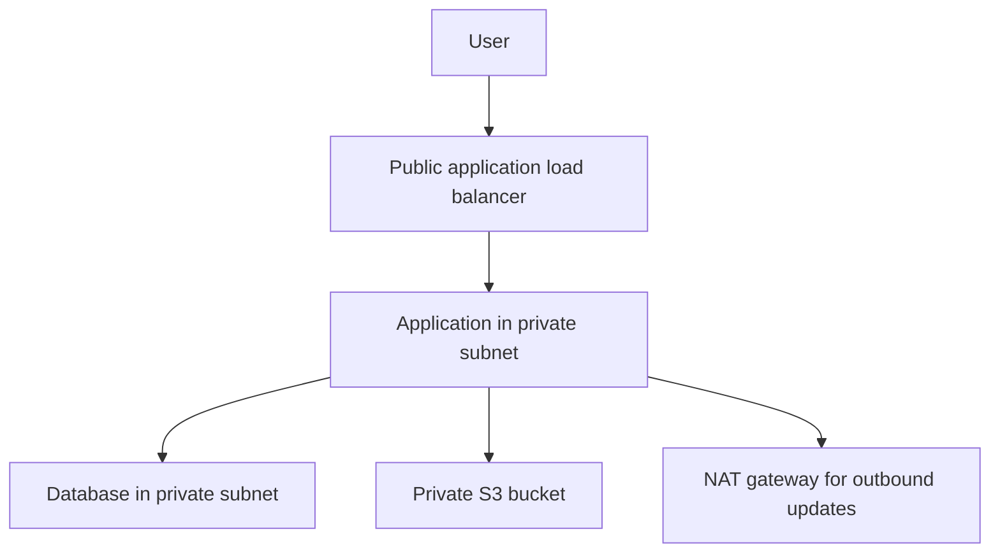

# Secure Application and Document Storage

## Scenario

A training company needs an application with a private database and private storage for learner documents.

## Proposed architecture

## Limitations and cost assumptions

- This is a design-only proposal. AWS resources were not deployed, so availability and recovery have not been tested.
- Costs would depend on region and usage. Main cost drivers are the load balancer, application servers, database, NAT gateway, S3 storage, and logging.

## Network and access rules

- Public subnets contain the load balancer and NAT gateway. Internet users can reach the application only through HTTPS on the load balancer.
- Application servers run in private subnets with no public IP. They use the NAT gateway only for required outbound updates.
- The database is in private subnets with no internet route. Only the application security group can connect to it.
- The S3 bucket is outside the VPC. An S3 gateway endpoint lets the private application reach it without sending document traffic over the public internet.

## Design details

### Routes and network boundaries

- The load balancer sits in public subnets and accepts HTTPS on port 443.
- Application tasks sit in private subnets without public IP addresses. They receive traffic from the load balancer only.
- Application subnets use a NAT gateway for required outbound updates. Traffic to S3 uses a gateway endpoint instead.
- The database sits in private database subnets with no internet route. Its security group allows PostgreSQL traffic on port 5432 only from the application security group.
- S3 is an AWS service outside the VPC. The gateway endpoint provides a private route from the application to the bucket.

### Access, encryption and audit

- S3 Block Public Access is enabled. The bucket policy denies public access and requests that do not use TLS.
- The application uses a least-privilege IAM role scoped to the required document bucket and learner prefixes. The application checks each user's permission before returning a document.
- A separate, restricted recovery role can read and restore prior object versions. It is not used for normal application requests.
- TLS protects data in transit. S3 objects and database storage use encryption at rest with KMS keys.
- Database credentials are stored in a managed secrets service, not in the repository.
- CloudTrail records document access and recovery events. Logs must not include document contents or credentials.
